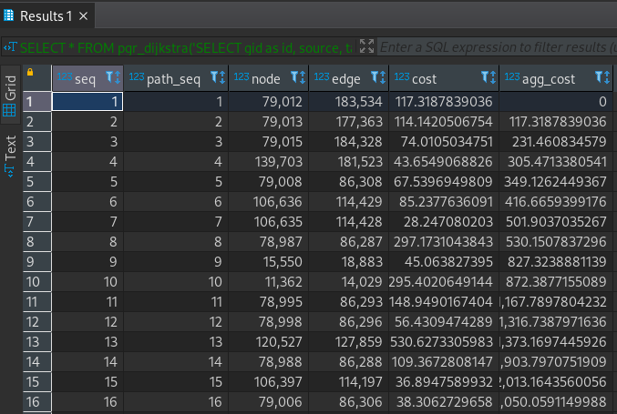
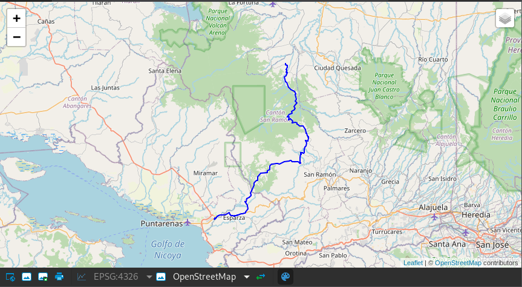
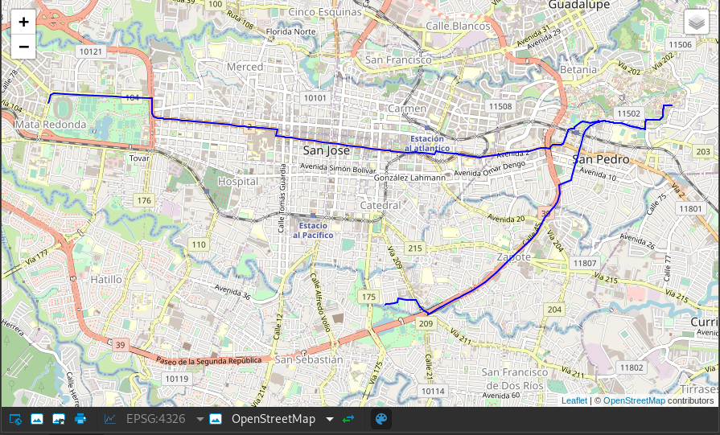
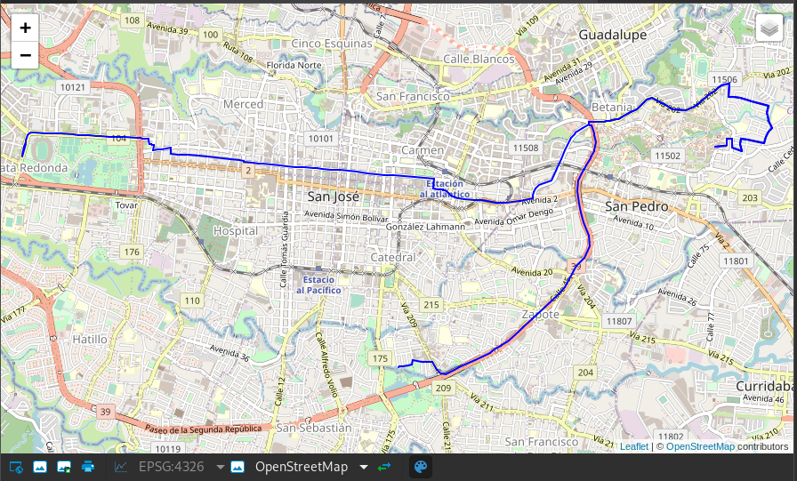

# **Taller pgRouting - III Jornadas del SIG y TD Libre de Costa Rica**


*Este taller está basado en los [Workshops de pgRouting de los FOSS4G](https://workshop.pgrouting.org/) sin los cuales hubiera sido imposible aprender a usar pgRouting. Gracias!*
## **1. ¿Qué es pgRouting?**

pgRouting es una extensión para PostgreSQL/PostGIS que añade funcionalidades para ánalisis de redes y planificación de rutas. Esto nos permite realizar cálculos de rutas óptimas, áreas de servicio e iscocronas (con la ayuda de PostGIS o QGIS), desde la propia base de datos con los beneficios que esto conlleva:
* Los datos pueden ser modificados desde diversos tipos de clientes:  
  * SIG de Escritorio (QGIS, gvSIG, uDig, etc)
  * Aplicaciones web
  * Dispositivos móviles
* Las modificaciones de los datos pueden reflejarse de forma inmediata en el motor de enrutamiento.
* Los parámetros de costo de desplazamiento por la red puede calcularse de forma dinámica usando SQL, permitiendo utilizar atributos de diferentes campos o tablas (por ejemplo, la velocidad máxima permitida en una carretera).

La librería pgRouting contiene los siguientes algoritmos:
* [Algoritmo de Dijkstra](https://es.wikipedia.org/wiki/Algoritmo_de_Dijkstra)
* [Algoritmo de Johnson](https://es.wikipedia.org/wiki/Algoritmo_de_Johnson)
* [Algoritmo de Floyd-Warshall](https://es.wikipedia.org/wiki/Algoritmo_de_Floyd-Warshall)
* [Algoritmo A*](https://es.wikipedia.org/wiki/Algoritmo_de_b%C3%BAsqueda_A*)
* [Algoritmos bidireccionales](https://en.wikipedia.org/wiki/Bidirectional_search): Dijkstra y A* bidireccionales
* [Problema del viajante](https://es.wikipedia.org/wiki/Problema_del_viajante)
* Distancia manejando
* [Camino más corto con restricción de giros](https://docs.pgrouting.org/3.2/es/pgr_trsp.html)
* Etc.

pgRouting es una librería de código abierto disponible con la licencia GPLv2 y soportada y mantenida por
[Georepublic](http://georepublic.info/), [iMaptools](http://imaptools.com/) y una amplica comunidad de usarios.

La mantenedora principal es [Vicky Vergara](https://twitter.com/VickyVvergara)

## **2. Estructura de datos**

Los archivos para el taller los podemos encontrar en la carpeta data del repositorio, están comprimidos en un zip que contiene el *dump* de la base de datos sobre la que vamos a trabajar.

La estructura básica que necesitamos para empezar a trabajar con PgRouting es una capa de líneas (o tabla de base de datos) con una buena calidad topológica (que no tenga lineas desconectadas, líneas trazadas en el sentido equivocado, etc). Si queremos hacer cálculos en función del tiempo de desplazamiento necestaremos además un campo que contenga la velocidad máxima permitida en la vía y longitud de la linea (en metros). Si además queremos tener en cuenta el sentido de circulación necesitamos un atributo que nos indique el sentido de circulación o si la vía es de doble sentido.

Además de la "capa" de líneas necesitamos una capa de nodos de la red. Estos nodos definen las conexiones entre calles y carreteras. La capa de lineas tiene que contener para cada segmento de la red cuál es el nodo de origen y el nodo de destino que conecta. Así que finalmente la capa de lineas tiene que contener dos atributos más, nodo de origen y nodo de estino (source y target). pgRouting tiene algunas herramientas para facilitar la creación de una red con la topología y los atributos necesarios, podéis encontrar más información [aquí - Crear una base de datos de Ruteo - Documentación de pgRouting](https://docs.pgrouting.org/3.2/es/pgRouting-concepts.html#create-a-routing-database)

### OpenStreetMap

Una de las fuentes de datos con la que podemos trabajar es OpenStreetMap, ya que actualmente existen herramientas que nos permiten importar los datos con la estructura que requiere pgRouting. Para ello necesitamos dos cosas:
* Descargar los datos de OSM desde:
  * https://www.openstreetmap.org (nos ubicamos el en el área de interés y luego hacemos click en Overpass API)
  * Descargamos los conglomerados a nivel subregión, país o ciudad desde https://download.geofabrik.de
* Instalar [osm2pgrouting](https://github.com/pgRouting/osm2pgrouting). Existen paquetes para varios sistemas operativos.


osm2pgrouting nos va a permitir generar toda la estructura de base de datos que necesitamos para pgRouting de forma sencilla y rápida. El único incoveniente es que si queremos procesar conjuntos de datos muy grandes (por ejemplo, todo un estado de México o un país completo) vamos a necesitar hacerlo por partes (eliminando el parámetro --clean) o contar con un servidor o pc con suficiente memoria RAM.

El ejemplo que aparece a continuación importaría a nuestra base de datos PostgreSQL de nombre `ruteo`, el archivo que descargamos de Openstreetmap "tu_archivo_osm_xml.osm" usando la configuración en el archivo de configuración mapconfig.xml.

```bash
osm2pgrouting --f tu_archivo_osm_xml.osm --conf mapconfig.xml --dbname ruteo --username postgres --clean
```

A continuación se muestra la ayuda de osm2pgrouting:

```bash
osm2pgrouting --help
Allowed options:

Help:
 --help                Produce help message for this version.
 -v [ --version ]      Print version string

General:
  -f [ --file ] arg                     REQUIRED: Name of the osm file.
  -c [ --conf ] arg (=/usr/share/osm2pgrouting/mapconfig.xml)
                                        Name of the configuration xml file.
  --schema arg                          Database schema to put tables.
                                          blank: defaults to default schema 
                                                dictated by PostgreSQL 
                                                search_path.
  --prefix arg                          Prefix added at the beginning of the 
                                        table names.
  --suffix arg                          Suffix added at the end of the table 
                                        names.
  --addnodes                            Import the osm_nodes, osm_ways & 
                                        osm_relations tables.
  --attributes                          Include attributes information.
  --tags                                Include tag information.
  --chunk arg (=20000)                  Exporting chunk size.
  --clean                               Drop previously created tables.
  --no-index                            Do not create indexes (Use when indexes
                                        are already created)

Database options:
  -d [ --dbname ] arg                   Name of your database (Required).
  -U [ --username ] arg                 Name of the user, which have write 
                                        access to the database.
  -h [ --host ] arg (=localhost)        Host of your postgresql database.
  -p [ --port ] arg (=5432)             db_port of your database.
  -W [ --password ] arg                 Password for database access.
 ```

El parámetro --conf nos permite utilizar un archivo de configuración para osm2pgrouting que va a definir que tipos de carreteras o vías queremos utilizar y cual es la velocidad de desplazamiento en cada tipo de vía. Por defecto vamos a encontrar 3 configuraciones en la carpeta `/usr/share/osm2pgrouting/` (la ubicación depende del sistema operativo):
* Para bicicletas
* Para automóviles
* Para peatones

Si queremos podemos modificar los archivos de coniguración para que se adapte a nuestras necesidades, qué tipo de vías vamos a importar (definido por los tipos de vías de OSM) y la velocidad máxima a utilizar para cada tipo de vía.

#### Beneficios e incovenientes de Utilizar OSM
**Pros:**
1. Los datos se manejan como un único conjunto de datos, es decir no son dos capas de información separadas, una para carreteras y otra para calles en zonas urbanas.
2. La información está en algunos casos más actualizada.
3. Las líneas cuentan con todos los atributos necesarios para pgRouting.
4. Los nodos de conexión de la red siguen reglas precisas de manera que aunque dos lineas se crucen puede no existir un nodo de conexión ya sea porque hay un paso a desnivel, un tunel o un puente. Esto mejora la topología de la red y elimina posibles errores de conexión.
5. En general facilita enormemente la creación de una red "ruteable".

**Contras:**
1. Puede que los datos en tu región no estén tan completos o actualizados como desearías. **Por eso te recomendamos que contribuyas a OSM.**
2. La herramienta osm2pgrouting puede consumir enormes cantidades de memoria RAM por lo que necesitamos hacer importaciones "incrementales" si queremos trabajar en regiones muy grandes (también podemos utilizar un servidor en la nube o un PC con mucha RAM para hacer el proceso y una vez creada la red descargarla a un servidor con menos memoria RAM o un PC).
3. No existen nodos "intermedios", es decir, si ruteamos desde un punto arbitrario vamos a tener que hacer algunos "trucos" para conseguir un buen resultado. Esto va a mejorar con las "nuevas" funciones `pgr_withPoints` incluida en la versión 3.2.0

### INEGI (México)

La [Red Nacional de Caminos de INEGI](https://www.inegi.org.mx/app/biblioteca/ficha.html?upc=889463674641) soporta el estándar internacional ISO 14825:2011 Intelligent Transport Systems_Geographic Data Files_GDF5.0, la cual integra los elementos necesarios para ruteo, ya tiene el formato necesario para pgRouting:
* Capa red_vial: Contiene las carreteras. Tiene como atributos VELOCIDAD, UNION_INI (nodo de inicio) y UNION_FIN (nodo de destino) y LONGITUD.
* Capa union: Puntos que representan los nodos (uniones) de los segmentos de la red de caminos.Tiene el atributo ID_UNION que es el identificador que está almacenado en los campos UNION_INI y UNION_FIN de la capa. red_vial
* Localidad: Localidades de México (puntual). Muchas de las localidades tiene las mismas coordenadas que los puntos de la capa de unión.

**Pros:**
* Ya viene preparada para ruteo con lo que simplifca mucho la creación de la red

**Contras:**
* La capa red_vial no incluye la mayoría de las calles de los núcleos urbanos, solo algunas de las vías principales que las cruzan.

## **Conexión a la base de datos**

Para agilizar el taller no vamos a realizar la instalación de PostgreSQL, PostGIS y pgRouting. Utilizaremos una base de datos en un servidor remoto. Para conectar al servidor vamos a usar [pgAdmin4](https://pgadmin.org), [dBeaver](https://dbeaver.io/) o [QGIS](https://qgis.org).

IP del Servidor: xx.xx.xx.xx

Los datos están en la base de datos `crrouting` en el schema `costarica`.

## **3. Algoritmos de pgRouting**

*NOTA:*
* Muchas de las funciones de pgRouting incluyen parámetros del tipo sql::text, es decir una consulta sql como una cadena de texto. Esto puede parecer algo confuso al principio pero permite gran flexibilidad ya que el usuario puede pasar cualquier sentencia `SELECT` como argumento para una función siempre que el resultado de dicho `SELECT` contenga el número de atributos requerido y los nombres de atributos correctos.
* La mayoría de los algoritmos de pgRouting no necesitan la geometría de la red, **excepto A*** que utiliza las coordenadas de los nodos de inicio y fin de cada segmento de la red durante el cálculo de rutas.
* La mayoría de los algoritmos de pgRouting no retornan una geometría, si no una lista ordenada de nodos o segmentos.

### 3.1 pgr_dijkstra

El algoritmo de Dijkstra fue el primer algorimto implementado en pgRouting. Solo requiere los atributos , `ìd` , `source` y `target`, `cost` y `reverse_cost` (opcional). Podemos especificar si el grafo es dirigido o no dirigido (tendrá en cuenta el sentido de las vias o no, parámetro `directed`).

**Resumen de Firmas**
```sql
pgr_dijkstra(edges_sql, start_vid,  end_vid)
pgr_dijkstra(edges_sql, start_vid,  end_vid  [, directed])
pgr_dijkstra(edges_sql, start_vid,  end_vids [, directed])
pgr_dijkstra(edges_sql, start_vids, end_vid  [, directed])
pgr_dijkstra(edges_sql, start_vids, end_vids [, directed])
pgr_dijkstra(Edges SQL, Combinations SQL [, directed])
RETURNS SET OF (seq, path_seq [, start_vid] [, end_vid], node, edge, cost, agg_cost)
OR EMPTY SET
```

Las firmas corresponden a las siguientes combinaciones:
 1. Un origen y un destino (1:1)
 2. Igual pero dirigido
 3. Un origen y muchos destinos (1:n)
 4. Muchos orígenes y un destino (n:1)
 5. Muchos origenes y muchos destinos (n:m)

#### 3.1.1 Ejercicio 1 - Un origen y un destino
Como comentamos en la nota anterior uno de los parámetros es un `SELECT` que se lo pasamos a la función como una cadena de texto. También hay que dar un alias al parámetro length_m para que la función entienda que es el costo. El costo puede ser cualquier atributo, en este caso usamos el atributo length_m pero podría ser tiempo en segundos (la ruta más rápida) o cualquier atributo que represente el costo de desplazamiento por la red. Después del `SELECT` tenemos los IDs de los nodos entre los que queremos calcular la ruta más corta. Finalmente tenemos el parámetro `directed` que nos indica si queremos que la ruta tenga en cuenta el sentido de circulación o no.

```sql
SELECT * FROM pgr_dijkstra('SELECT gid as id,
         source,
         target,
         length_m AS cost
        FROM costarica.ways',
    79012, 35280,
    directed := false)
```
El resultado de la consulta es una tabla con las columnas:
* `seq`: Identificador único
* `path_seq`: Secuencia dentro de la ruta
* `start_vid`: Nodo de inicio de la ruta.
* `node`: Nodo por el que pasa la ruta
* `edge`: Segmento de la red
* `cost`: Costo de desplazamiento por el segmento
* `agg_cost`: Costo agregado para cada paso de la ruta  

Como la función pgr_dijkstra no retorna las geometrías vamos a generar una consulta que nos permita obtener las geometrías de la red para poder visualizar la ruta. En este caso estamos trayendo las geometrías de los segmentos de la red que están en la tabla costarica.ways mediante un join entre el id del segmento, edge, retornado por la función pgr_dijkstra y la llave primaria de la tabla costarica.ways, gid.

```sql
WITH ruta as (SELECT * FROM pgr_dijkstra(
    'SELECT gid as id,
         source,
         target,
         length_m AS cost
        FROM costarica.ways',
    79012, 35280,
    directed := false))
SELECT ruta.*, w.the_geom
FROM ruta
LEFT JOIN costarica.ways w ON ruta.edge = w.gid ;
```
Podemos visualizar el resultado de la consulta directamente en pgAdmin4 haciendo clic en el botón con un ojo. También podriamo visualizarlo en QGIS.






#### 3.1.2 Ejercicio 2 - Varios orígenes y un destino
En este caso vamos especificar varios orígenes y un destino:
* Los orígenes son los nodos: 3443 y 79012
* Para el costo vamos a volver a utilizar el atributo length_m

Para pasarle los origenes a la función pgr_dijkstra tenemos que usar un `ARRAY` (arreglo: conjunto de elementos del mismo tipo).

```sql
 SELECT * FROM pgr_dijkstra('SELECT gid as id,
         source,
         target,
         length_m AS cost
        FROM costarica.ways',
    ARRAY[3443, 79012], 35280,
    directed := false)
```
```sql
WITH ruta as (SELECT * FROM pgr_dijkstra(
    'SELECT gid as id,
         source,
         target,
         length_m AS cost
        FROM costarica.ways',
    ARRAY[3443, 79012], 35280,
    directed := false))
SELECT ruta.*, w.the_geom
FROM ruta
LEFT JOIN costarica.ways w ON ruta.edge = w.gid;
```

#### 3.1.3 Ejercicio 3 - Un solo origen varios destinos

En este caso vamos especificar un origen y varios destinos:
* El origen es el nodos: 154802 (Escuela de Geografía - Universidad de Costa Rica)
* Los nodos de destino son: 149541 (Estadio Nacional) y 267 (Parque de la Paz)
* Para el costo vamos a utilizar el tiempo de desplazamiento suponiendo una velocidad constante de 20 km/h (5.56 m/s).`v = 5.56 m/s` y `t=d/v`

```sql
SELECT * FROM pgr_dijkstra('SELECT gid as id,
         source,
         target,
         length_m / 5.56 AS cost
        FROM costarica.ways',
    154802, ARRAY[149541, 267],
    directed := false)
```
```sql
WITH ruta as (SELECT * FROM pgr_dijkstra('SELECT gid as id,
        source,
        target,
        length_m / 5.56 AS cost
       FROM costarica.ways',
   154802, ARRAY[149541, 267],
   directed := false))
SELECT ruta.*, b.the_geom
FROM ruta
LEFT JOIN costarica.ways b ON ruta.edge = b.gid;
```        

¿Qué ocurre si cambiamos el parámetro de no dirigido a dirigido (`directed:=true`)?¿En qué unidades estamos midiendo el costo de desplazamiento en este último ejercicio?






#### 3.1.4 Ejercicio 4 - Varios orígenes y varios destinos

En este caso vamos especificar varios origenes y varios destinos:
* El origen es el nodos: 154802 y 176389 (Geografía y Económicas)
* Los nodos de destino son: 149541 (Estadio Nacional) y 267 (Parque de la Paz)
* Para el costo vamos a utilizar el tiempo de desplazamiento suponiendo una velocidad constante de 20 km/h (5.56 m/s) `v = 5.56 m/s` y `t=d/v`, pero en este caso vamos a obtener el tiempo en minutos.

```sql
SELECT * FROM pgr_dijkstra('SELECT gid as id,
         source,
         target,
         length_m / 5.56 / 60 AS cost
        FROM costarica.ways',
    ARRAY[154802, 176389], ARRAY[149541, 267],
    directed := false)
```
```sql
WITH ruta as (SELECT * FROM pgr_dijkstra('SELECT gid as id,
        source,
        target,
        length_m / 5.56 / 60 AS cost
       FROM costarica.ways',
   ARRAY[154802, 176389], ARRAY[149541, 267],
   directed := false))
SELECT ruta.*, w.the_geom
FROM ruta
LEFT JOIN costarica.ways w ON ruta.edge = w.gid;
```    

*NOTA*: Si inspeccionamos el resultado de las consulta, veremos que hay algunas filas que tiene edge=-1, estas filas nos indican el costo total de cada ruta.

### 3.2 pgr_dijkstraCost
Si lo que queremos es calcular el costo total de desplazamiento podemos simplemente utilizar `pgr_dijkstraCost` que nos resultados más simples. El nodo de origen, el de destino y el costo acumulado total.

**Resumen de Firmas**
```sql
pgr_dijkstraCost(edges_sql, start_vid,  end_vid)
pgr_dijkstraCost(edges_sql, start_vid,  end_vid  [, directed])
pgr_dijkstraCost(edges_sql, start_vid,  end_vids [, directed])
pgr_dijkstraCost(edges_sql, start_vids, end_vid  [, directed])
pgr_dijkstraCost(edges_sql, start_vids, end_vids [, directed])
pgr_bdDijkstraCost(Edges SQL, Combinations SQL [, directed])

RETURNS SET OF (start_vid, end_vid, agg_cost)
    OR EMPTY SET
```

De nuevo, aquí tenemos las mismas combinaciones que antes: 1:1, 1:n, n:1 y n:m.

#### 3.2.1 Ejercicio 5 - Calcular el costo total entre varios orígenes y varios destinos
Aquí el costo vuelve a ser el tiempo en minutos suponiendo una velocidad constante de 20 km/h (5.56 m/s).
```sql
SELECT * FROM pgr_dijkstraCost('SELECT gid as id,
        source,
        target,
        length_m / 5.56 / 60 AS cost
       FROM costarica.ways',
   ARRAY[154802, 176389], ARRAY[149541, 267],
   directed := false)
```
#### 3.2.2 Ejercicio 6 - Resumen de los costos totales por origen entre varios orígenes y varios destinos
En este caso tenemos que utilizar la clausula `GROUP BY` para obtener los resultados agrupados para cada origen.
```sql
SELECT start_vid, sum(agg_cost) as tiempo_total
FROM pgr_dijkstraCost('SELECT gid as id,
        source,
        target,
        length_m / 5.56 / 60 AS cost
       FROM costarica.ways',
   ARRAY[154802, 176389], ARRAY[149541, 267],
   directed := false)
GROUP BY start_vid
ORDER BY start_vid;
```
¿En cuál facultad nos conviene más estudiar si queremos ir al estadio y al parque frecuentemente?

## **4. Funciones Avanzadas de Ruteo**

### **4.1 Ruteo para vehículos**
Una consulta para ruteo de vehículos es diferente a una para peatones. Algunas diferencias:
* Los segmentos de la red de carreteras suelen considerarse "dirigidos" (pueden tener limitaciones en cuanto al sentido en el que pueden recorrerse)
* El costo puede ser:
  * Distancia
  * Tiempo
  * Dinero
  * Emisiones de CO2
  * Desgaste del vehículo, etc.
* El atributo reverse_cost debe tenerse en cuenta en vias de doble sentido
  * El costo tiene que tener las mismas unidades que el atributo cost
  * cost y reverse_cost pueden ser diferentes (Esto es debido a que existen vias de sentido único)

Dependiendo de la geometría, la forma válida:
* segmento (origen, destino) (`cost >= 0` y `reverse_cost` < 0)
* segmento (destino, origen) (`cost < 0` y `reverse_cost` >= 0)

De manera que un "sentido contrario" se indica mediante un valor negativo y no es insertado en el grafo para su procesamiento.

Para vías de doble sentido `cost >= 0` y `reverse_cost >= 0` y sus valores pueden ser diferentes. Por ejemplo, es más rápido ir hacia abajo en una carretera con pendiente que hacia arriba. En general `cost` y `reverse_cost` no tienen porque ser distancias, en realidad pueden ser casi cualquier cosa, por ejemplo: tiempo, pendiente, superficie, tipo de carretera, o una combinación de varios parámetros.

#### 4.1.1 Ejercicio 7 - Ruteo para vehículos - Ida
Desde el Escuela de Geografía al Estado Nacional:
* El vehículo va desde el nodo 154802 al nodo 149541
* Usaremos los atributos `cost` y `reverse_cost` que están en grados decimales, debido al sistema de referencia de coordenadas que osm2pgrouting usa por defecto (EPSG:4326).

```sql
SELECT * FROM pgr_dijkstra('SELECT gid as id,
         source,
         target,
         cost,
         reverse_cost
        FROM costarica.ways',
    154802, 149541,
    directed := true);
```

```sql
WITH ruta as (SELECT * FROM pgr_dijkstra(
    'SELECT gid as id,
         source,
         target,
         cost,
         reverse_cost
        FROM costarica.ways',
    154802, 149541,
    directed := true))
SELECT ruta.*, b.the_geom
FROM ruta
LEFT JOIN costarica.ways b ON ruta.edge = b.gid;
```

#### 4.1.2 Ejercicio 8 - Ruteo para vehículos - Regreso
Desde el Estado Nacional a la Escuela de Geografía:
* El vehículo va desde el nodo 149541 al nodo 154802.
* Usaremos los atributos `cost` y `reverse_cost` que están en grados decimales.

```sql
SELECT * FROM pgr_dijkstra('SELECT gid as id,
         source,
         target,
         cost,
         reverse_cost
        FROM costarica.ways',
     149541, 154802,
    directed := true);
```

```sql
WITH ruta as (SELECT * FROM pgr_dijkstra(
    'SELECT gid as id,
         source,
         target,
         cost,
         reverse_cost
        FROM costarica.ways',
    149541, 154802,
    directed := true))
SELECT ruta.*, b.the_geom
FROM ruta
LEFT JOIN costarica.ways b ON ruta.edge = b.gid;
```
En un grafo dirigido las rutas de ida y retorno son casi siempre diferentes.

#### 4.1.3 Ejercicio 9 - Ruteo para vehículos - Cuando el tiempo es oro
Desde el Escuela de Geografía al faro de Punta Arenas:
* El vehículo va desde el nodo 154802 al nodo 22833
* El costo es `₡1000 por hora`
* Usaremos los atributos `cost_s` y `reverse_cost_s` que están en segundos.
* La duración del viaje en horas es `cost_s / 3600`
* El costo del viaje en colones es `cost_s * 1000 / 3600`

Los atributos `cost_s` y `reverse_cost_s` se calculan usando la longitud de un segmento de la red y los atributos `maxspeed_forward` y `maxspeed_backward` (velocidad máxima y velocidad máxima hacia atrás). Estas velocidades vienen definidas en el archivo de configuración que utilizamos junto con osm2pgrouting para importar los datos a nuestra base de datos.

```sql
SELECT * FROM pgr_dijkstra('SELECT gid as id,
         source,
         target,
         cost_s * 1000 / 3600 as cost,
         reverse_cost_s * 1000 / 3600 as reverse_cost
        FROM costarica.ways',
    154802, 22833,
    directed := true);
```

```sql
WITH ruta as (SELECT * FROM pgr_dijkstra(
    'SELECT gid as id,
         source,
         target,
         cost_s * 1000 / 3600 as cost,
         reverse_cost_s * 1000 / 3600 as reverse_cost
        FROM costarica.ways',
    154802, 22833,
    directed := true))
SELECT ruta.*, b.the_geom
FROM ruta
LEFT JOIN costarica.ways b ON ruta.edge = b.gid;
```
Como podemos la ruta prefiere las carreteras de alta velocidad.

### **4.2 Manipulación de los costos**

Cuando usamos datos de OSM importados a través de la herramienta osm2pgrouting, se crean algunas tablas adicionales, una de ellas se llama `configuration`. Esta tabla contiene los parámetros de importación que definimos en el archivo `mapconfig_for_cars_mod.xml`. Vamos a explorar los `tag_id` (identificador de etiqueta) de red.
```sql
SELECT tag_id, tag_key, tag_value
FROM costarica.configuration
ORDER BY tag_id;
```
```sql
SELECT *
FROM costarica.configuration;
```
#### 4.2.1 Ejercicio 10 - Ruteo para vehículos sin penalización

Para modificar el comportamiento de los algoritmos vamos añadir una columna llamada `penalty` a la tabla `costarica.configuration` y usarla para recalcular el costo de desplazamiento en función de unos criterios definidos por nosotros mismos. A continuación mostramos algunos ejemplos:

```sql
ALTER TABLE costarica.configuration ADD COLUMN penalty FLOAT;
-- Sin penalización
UPDATE costarica.configuration SET penalty=1;
```
Ahora al calcular la ruta vamos a traer el atributo `penalty` haciendo un `join` con la tabla `costarica.configuration` usando el campo `tag_id` que también está en la tabla `costarica.ways`
```sql
WITH ruta as (SELECT * FROM pgr_dijkstra('
    SELECT gid AS id,
        source,
        target,
        cost_s * penalty AS cost,
        reverse_cost_s * penalty AS reverse_cost
    FROM costarica.ways JOIN costarica.configuration
    USING (tag_id)',
    154802, 22833,
   directed := true))
SELECT ruta.*, b.the_geom
FROM ruta
LEFT JOIN costarica.ways b ON ruta.edge = b.gid;
```
#### 4.2.2 Ejercicio 10 - Ruteo para vehículos con penalización

Vamos a cambiar los valores de `penalty` para que algunos tipos de vía no sea utilizados:

```sql
--- Vamos a modificar el penalty de las vías primarias
UPDATE costarica.configuration SET penalty=100 WHERE tag_value = 'primary';
```
Ahora volvemos a calcular la ruta:
```sql
WITH ruta as (SELECT * FROM pgr_dijkstra('
    SELECT gid AS id,
        source,
        target,
        cost_s * penalty AS cost,
        reverse_cost_s * penalty AS reverse_cost
    FROM costarica.ways JOIN costarica.configuration
    USING (tag_id)',
    154802, 22833,
   directed := true))
SELECT ruta.*, b.the_geom
FROM ruta
LEFT JOIN costarica.ways b ON ruta.edge = b.gid;
```
¿Qué ha cambiado con respecto al ejercicio 9?

### **4.3 Isocronas**
Las isocronas son iso-lineas que unen puntos con el mismo tiempo de deslazamiento respecto a un origen. Para este ejercicio vamos a usar la red de carreteras de OSM, y la función de pgRouting `pgr_drivingDistance`.

#### 4.3.1 pgr_drivingDistance

La función pgr_drivingDistance calcula la distancia manejando/conduciendo desde uno o varios nodos iniciales. Usando el algoritmo de Dijkstra extrae todos los nodos que tengan un costo de desplazamiento igual o menor al valor `distance`, este parámetro puede ser en unidades de tiempo o distancia (las mismas que el parámetro de costo que vayamos a utilizar).

**Sumario de Signaturas**

```sql
pgr_drivingDistance(edges_sql, start_vid, distance) -- Un único nodo de origen
pgr_drivingDistance(edges_sql, start_vid, distance, directed) -- Un único nodo de origen dirigido
pgr_drivingDistance(edges_sql, start_vids, distance, directed, equicost) -- Varios nodos de origen

RETURNS SET OF (seq, [start_vid,] node, edge, cost, agg_cost)
```
El algoritmo retorna una sequencia, el nodo de inicio `start_vid,`, el nodo actual de la ruta `node`, el segmento recorrido `edge` para llegar al nodo actual, el costo y el costo acumulado desde `start_vid` a `node`.

#### 4.3.2 Ejercicio 11 - Un solo origen
Para este ejericio vamos a calcular la distancia de manejo desde el Hospital San Rafael de Alajuela (`id = 155390`) y `distance = 1800` (en segundos). En parmetro de `id` lo hemos calculado previamente asignando el nodo más cercano de la red de carreteras de OSM.

Para realizar este proceso hemos utilizado la consulta que aparece a continuación. En ella para cada hospital calculamos cual es el nodo de la red (tabla `costarica.ways_vertices_pgr`) más cercano a cada hospital y la distancia a la que se encuentra. El atributo de la distancia nos da una idea de lo correcto que puede ser el cálculo de una ruta para cada hospital.  Este proceso de encontrar el nodo más cercano de la red lo vamos a tener que realizar siempre ya que para los parámetros de `start_vid` y `end_vid` de los diferentes algoritmos siempre tenemos que utilizar las IDs de los nodos de la red (en este caso es el atributo `id`)

```sql
ALTER TABLE costarica.hospitales
ADD COLUMN id_nodo integer,
ADD COLUMN distancia integer;

WITH foo as (
SELECT
hospitales.gid,
closest_node.id,
closest_node.dist
FROM costarica.hospitales
CROSS JOIN LATERAL -- Este CROSS JOIN lateral funciona como un bucle "for each"
(SELECT
 id,
 ST_Distance(wvp.the_geom::geography, hospitales.geom::geography) as dist
 FROM costarica.ways_vertices_pgr wvp 
 ORDER BY wvp.the_geom <-> hospitales.geom
 LIMIT 1 -- Este limit 1 hace que solo obtengamos el nodo más cercano de la red
) AS closest_node)
UPDATE costarica.hospitales -- Finalmente actualizamos la capa de hospitales
SET id_nodo = foo.id,
distancia = foo.dist
FROM foo
WHERE hospitales.gid = foo.gid;

```
Ahora ya estamos listos para usar el algoritmo pgr_drivingDistance, a partir del que luego podemos generar las isocronas (utilizando QGIS).

```sql
-- Puntos (nodos)
select
	row_number() over (order by seq) as gid, 
    subquery.seq,
	subquery.node,
	subquery.edge,
	subquery.cost,
	subquery.aggcost,
	wvp.the_geom as geom
FROM pgr_drivingDistance('SELECT
     gid as id,
     source,
     target,                                    
     cost_s AS cost
     FROM costarica.ways', 155390, 1800, false)
     subquery(seq, node, edge, cost, aggcost)
JOIN costarica.ways_vertices_pgr wvp ON subquery.node = wvp.id;

-- Lineas (edges)
SELECT 
	row_number() over (order by seq) as gid, 
	subquery.seq,
	subquery.node,
	subquery.edge,
	subquery.cost,
	subquery.aggcost,
	w.the_geom as geom
FROM pgr_drivingDistance('SELECT
     gid as id,
     source,
     target,                                    
     cost_s AS cost
     FROM costarica.ways', 155390, 1800, false)
     subquery(seq, node, edge, cost, aggcost)
JOIN costarica.ways w ON subquery.edge = w.gid;
```
#### 4.3.3 Ejercicio 12 - Varios orígenes
Para generar la distancias de manejo desde varios orígenes tenemos que volver a utilizar un `ARRAY`. En este caso concreto vamos a usar algunos`id` desde la tabla `costarica.hospitales` y pasárselos a `pgr_drivingDistance`. Para que podamos generar las isocronas de varios hospitales en conjunto tenemos que hacer dos procesos, primero calculamos la distancia de manejo desde cada hospital y posteriormente agrupamos los resulados por nodo (y geometría) y nos quedamos con el costo agregado mínimo que nos va a representar el tiempo mínimo desde ese nodo a un hospital.

```sql
WITH ruteo as (
  select
    subquery.seq,
  	subquery.start_v,
  	subquery.node,
  	subquery.edge,
  	subquery.cost,
  	subquery.aggcost,
  	wvp.the_geom as geom
  FROM pgr_drivingDistance('SELECT
       gid as id,
       source,
       target,                                    
       cost_s AS cost
       FROM costarica.ways',
       array(SELECT id_nodo FROM costarica.hospitales
       where nombre in ('HOSPITAL SAN VICENTE PAUL HEREDIA', 'HOSPITAL SAN RAFAEL DE ALAJUELA')), 1800, false)
       subquery(seq, start_v, node, edge, cost, aggcost)
  JOIN costarica.ways_vertices_pgr wvp ON subquery.node = wvp.id)
SELECT node, geom, min(aggcost) AS aggcost
FROM ruteo
GROUP By node, geom;
```
#### 4.3.4 Ejercicio 13 - isocronas

Para generar las isocronas necesitamos el resultado del ejercicio anterior, podemos utilizar varios métodos.

El primero es usando la función `pgr_alphaShape` que nos genera el "contorno" de isocrona usando el resultado de `pgr_drivingDistance`.

```sql
with subquery as (
    SELECT st_collect(wvp.the_geom) as geom
    FROM pgr_drivingDistance('SELECT 
			gid As id, 
			source,
			target,
            cost_s AS cost,
			reverse_cost_s as reverse_cost
            FROM costarica.ways', array(SELECT id_nodo FROM costarica.hospitales
       where nombre in ('HOSPITAL SAN VICENTE PAUL HEREDIA', 'HOSPITAL SAN RAFAEL DE ALAJUELA')), 450, false) AS di
     INNER JOIN costarica.ways_vertices_pgr AS wvp ON di.node = wvp.id
) select pgr_alphashape(geom, 1.5) as alphaGeom
from subquery;
```

Por lo que he podido comprobar todavía necesita un poco de trabajo porque hay algunos bugs. Si crecemos un poco el tiempo máximo veremos que empieza a fallar. Durante la triangulación de Delaunay que se utiliza en el cálculo de las Alpha Shapes pueden aparecer geometrías no válidas (olígonos que se convierten en líneas) que pueden generar errores e impedir la finalización del proceso. 

Otra opción, utilizar `ST_ConcaveHull' de PostGIS para aproximar el resultado. Siempre es recomendable validar los resultados para encontrar posibles errores en nuestra red.

```sql
with subquery as (
    SELECT st_collect(wvp.the_geom) as geom
    FROM pgr_drivingDistance('SELECT 
			gid As id, 
			source,
			target,
            cost_s AS cost,
			reverse_cost_s as reverse_cost
            FROM costarica.ways',array(SELECT id_nodo FROM costarica.hospitales
       where nombre in ('HOSPITAL SAN VICENTE PAUL HEREDIA', 'HOSPITAL SAN RAFAEL DE ALAJUELA')), 450, false) AS di
     INNER JOIN costarica.ways_vertices_pgr AS wvp ON di.node = wvp.id
)
```

La tercera opción implica el uso de QGIS o alguna otra herramienta que nos permita obtener una superficie continua de costo en formato raster, por ejemplo un TIN, y posteriormente extraer las isolineas usando alguna otra herramienta (gdal_contour es una opción). Esta opción en la más sencilla, ya que la obtención de conjuntos de isocronas es bastante complicada [usando solamente PostGIS](https://www.patreon.com/posts/isochrones-are-20933638?)

### **4.4 Ruteo Masivo**

Una de las capacidades más notables de pgRouting es la posibilidad de realizar operaciones con grandes cantidades de datos de forma extremadamente rápida. Por ejemplo, podemos contestar preguntas del tipo: ¿Cuáles hospitales son los más cercanos a cada la localidad de Costa Rica?¿Cuáles son los 3 hospitales más cercanos a cada localidad? ¿Cuáles localidades se encuentran a más de 30 minutos de una escuela?¿Cuál es la accesibilidad de las escuelas de todo un país?¿Qué zonas de un país tienen poca accesibilidad a un servicio (escuelas, centros de salud, taquerías, etc)?.

#### 4.4.1 Ejercicio 14 - Hospitales más cercanos a localidades
En este ejercicio vamos a utilizar la función `pgr_dijkstraCost` para analizar cuáles son los tres hospitales más cercanos a cada localidad de Costa Rica. Para ello vamos a usar las tablas `costarica.hospitales` y `costarica.lugares`. De nuevo vamos a utilizar arreglos (`ARRAY`) para definir los parametros de los nodos de origen y destino del algoritmo `pgr_dijkstraCost`.

Primero tenemos que asignar un nodo de la red a cada localidad.
```sql
ALTER TABLE costarica.hospitales
ADD COLUMN id_nodo integer,
ADD COLUMN distancia integer;

WITH foo as (
SELECT
lugares.gid,
closest_node.id,
closest_node.dist
FROM costarica.lugares
CROSS JOIN LATERAL
(SELECT
 id,
 ST_Distance(wvp.the_geom::geography, lugares.geom::geography) as dist
 FROM costarica.ways_vertices_pgr wvp 
 ORDER BY wvp.the_geom <-> lugares.geom
 LIMIT 1 -- Este limit 1 hace que solo obtengamos el nodo más cercano de la red
) AS closest_node)
UPDATE costarica.lugares
SET id_nodo = foo.id,
distancia = foo.dist
FROM foo
WHERE lugares.gid = foo.gid;
```

A continuación usamos `pgr_dijkstraCost` para calcular la matriz de costos entre localidades y hospitales.

```sql
CREATE TABLE costarica.localidadesVShospitales as (SELECT *
  FROM pgr_dijkstraCost(
      'SELECT gid as id,
           source,
           target,
           cost_s as cost
          FROM costarica.ways',
      array(SELECT id_nodo FROM costarica.lugares),
      array(SELECT id_nodo FROM costarica.hospitales),
      directed := false));
```
El resultado de esta consulta es una tabla `localidadesVShospitales` con el costo de desplazamiento acumulado `agg_cost` desde cada localidad `start_vid` a todos los hospitales `end_vid`.

A continuación vamos a seleccionar solo los tres hospitales más cercanos a cada localidad.

```sql
CREATE TABLE costarica.locpobvshospitalesrank as ( 
    SELECT foo.* FROM (
        SELECT localidadesVShospitales.*, rank() over (partition BY start_vid ORDER BY agg_cost asc)
FROM costarica.localidadesVShospitales) foo WHERE RANK <= 3);
```

Para terminar vamos a añadirle algunos datos más a la tabla.

```sql
CREATE TABLE costarica.matriz_locpobVShospitales as (
	SELECT row_number() over (order by a.start_vid) as id,
	a.start_vid as nodo_inicio,
	b."name" as localidad,
	a.end_vid as nodo_fin,
	c.nombre as hospital,
	a."agg_cost" / 60 as tiempo_minutos,
	a."rank",
	st_makeline(b.geom,c.geom) as geom
FROM costarica.locpobvshospitalesrank a
LEFT JOIN costarica.lugares b ON a.start_vid = b.id_nodo
LEFT JOIN costarica.hospitales c ON a.end_vid = c.id_nodo);
```